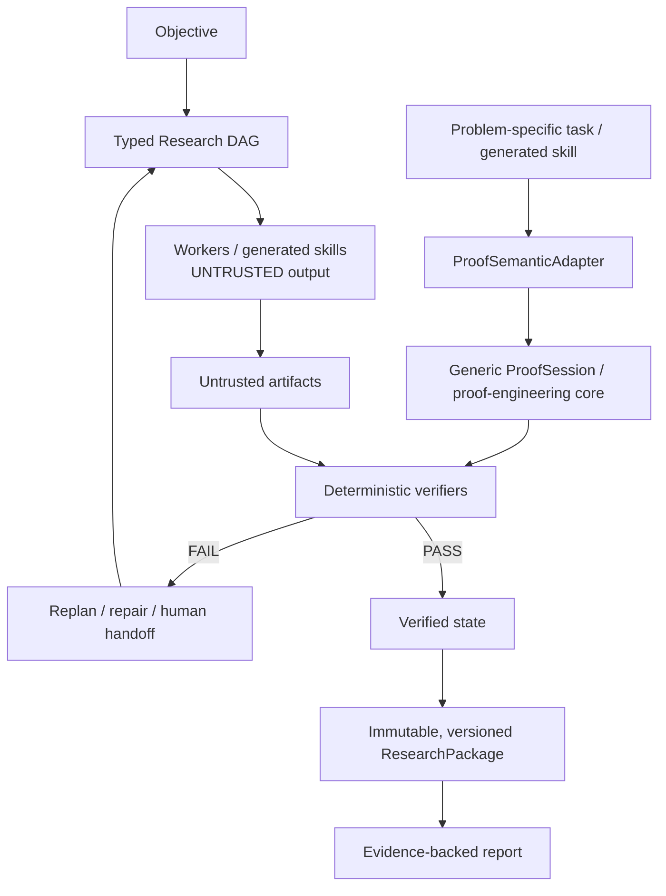

# ResearchGPT

## Verification-First Autonomous Research Orchestrator

ResearchGPT explores how LLM-driven research workflows can be made auditable, reproducible, and verification-gated. Its trusted product is not model output: it is the durable evidence, deterministic validation, and provenance that support a report.



The deterministic supervisor owns orchestration and validation. Model and tool output remain **UNTRUSTED** until a verifier accepts the relevant artifact. LLM output is not empirical evidence.

## Proof-first MVP

ResearchGPT tries to prove the theorem itself. On success, it exposes checked proof artifacts and provenance. When it stalls, it preserves verified progress, reduces the failure to a precise bottleneck, requests targeted help, treats that help as untrusted, checks it, and resumes the same `ProofSession`.

The MVP includes two demonstration classes.

### Finite constrained additive-basis experiment

Motivated by Erdős Problem #791, this bounded experiment combines autonomous semantic deductions, exact finite search, Lean-checked proof artifacts, durable evidence, claim/evidence hashes, and verifier-gated `ResearchPackage` construction. Its finite certificate uses Lean `native_decide`, with declared trust class `NATIVE_DECIDE`; it is **not** a pure kernel-reduction proof.

This is a finite constrained experiment only. It does not solve or estimate the asymptotic parent problem. Its novelty status is `UNCHECKED`, and ResearchGPT makes no novel mathematical-result claim.

### Generality and assisted-proof experiment

After the generic proof core was frozen, the system attempted a previously unseen, structurally different finite problem. It reached `ACTIONABLE_HANDOFF` instead of fabricating success. A human then supplied a small counting insight; the system checked the semantic hint, resumed the **same** proof session, used the verified hint causally, reduced the residual problem, and completed a Lean-checked finite result.

This is evidence for resumable, verifier-gated proof engineering—not a novel theorem or a benchmark record.

## Quickstart

Prerequisites: `python3` and a Lean executable available on `PATH`. The public MVP uses local deterministic computation and does not require paid inference.

```bash
export RESEARCH_ALLOW_PAID_FALLBACK=0
scripts/mvp-research-trial --root results/mvp-trial
```

The command writes immutable artifacts, verifier records, a provenance manifest, and a `ResearchPackage` beneath the supplied root. Use a new root for each run.

To exercise the durable proof-session interface with a committed public task:

```bash
scripts/proof-orchestrator session start \
  --task tools/proofbench/public/tasks/nat-add-zero.json \
  --result-root proofbench-results/session-demo
```

If the session returns `ACTIONABLE_HANDOFF`, inspect the emitted session and resume it only with a proposed lemma that can be independently checked:

```bash
scripts/proof-orchestrator session inspect --session proofbench-results/session-demo/SESSION_ID
scripts/proof-orchestrator session resume \
  --session proofbench-results/session-demo/SESSION_ID \
  --human-lemma 'your proposed formal lemma'
```

Replace `SESSION_ID` with the identifier printed by `session start`. A human suggestion is still untrusted until formal checking succeeds.

Focused MVP checks:

```bash
python3 -m unittest \
  tests.test_mvp_erdos791_trial \
  tests.test_proof_session \
  tests.test_research_package_proof_evidence
scripts/public-release-audit
```

These are focused checks, not a claim that the entire repository test suite is green.

## Evidence and trust model

`model proposal != verified evidence`.

For an exact formal claim, ResearchGPT requires a durable artifact, its hash, a verifier `PASS`, an allowed declared verifier trust class, and a claim-to-obligation linkage. `ResearchPackage` construction records immutable, versioned evidence where supported by the runtime; provenance establishes lineage, not correctness on its own.

The system distinguishes the evidence from the mechanism that produced it. Executable checks can validate implementations and finite computations; Lean can check encoded formal propositions under its declared trust model. Neither makes model prose into empirical evidence.

## Repository map

- `src/` — research state, artifact storage, verification, provenance, and the finite MVP trial.
- `tools/proofbench/` — proof engineering, `ProofSession`, and semantic-adapter interfaces.
- `tools/proofbench/adapters/` — problem-domain adapters that sit above the generic proof core.
- `tools/proofbench/public/` — committed public proof tasks and Lean specifications.
- `scripts/` — supported local launchers, including the MVP trial and proof orchestrator.
- `tests/` — focused behavioral and integrity checks.

The domain dependency direction is deliberately one-way: problem-specific task or generated skill → `ProofSemanticAdapter` → generic `ProofSession` and proof-engineering core. The generic session does not depend on an Erdős-specific implementation.

## Limitations

- Formal verification establishes the encoded proposition under the verifier's trust model, not novelty or scientific importance.
- Executable checks validate implementations and finite computations, not arbitrary scientific truth.
- Provenance establishes lineage, not correctness by itself; SAT/CNF artifacts are advisory unless backed by a checked certificate.
- Current finite Lean certificates may use `NATIVE_DECIDE`.
- Research completeness is not guaranteed, and local model quality affects autonomous progress.
- Human or stronger-model assistance may sometimes be required; there is no claim of autonomous publishable-paper generation, novelty, or a solution to open Erdős problems.
