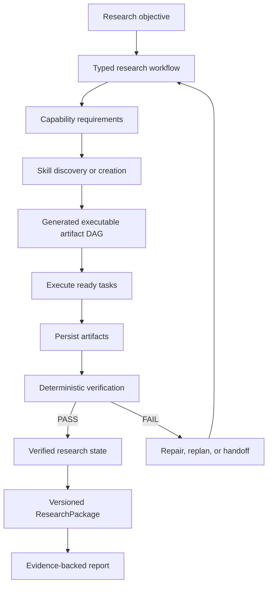
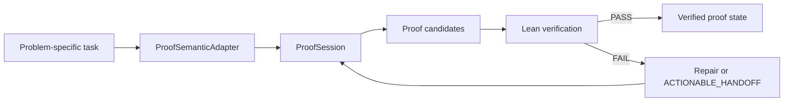

# ResearchGPT

**A verification-first research orchestrator that turns open-ended objectives into executable task graphs, generated skills, and checked artifacts.**

ResearchGPT is an experimental agent runtime for long-running research workflows. A run starts with a research objective, works out what capabilities and artifacts are needed, builds an executable dependency graph for that work, and verifies the resulting evidence before accepting claims.

The project focuses on engineering problems that become important when an agent has to do more than answer one prompt: decomposition, scheduling, typed state, tool generation, validation, retries, provenance, replay, and human handoff.

## Highlights

- Builds a per-run executable DAG from research capability requirements.
- Creates or resolves scoped executable skills for tasks the runtime needs to perform.
- Tracks dependencies and schedules work from explicit node state.
- Stores artifacts with hashes, provenance, and claim-to-evidence links.
- Uses deterministic verification gates before evidence is accepted.
- Preserves verified progress when one part of a run fails.
- Supports structured repair requests and resumable human handoffs.
- Integrates Lean for formally checked proof obligations.
- Keeps research execution separate from later paper generation.

The main systems idea is the generated execution graph. ResearchGPT first identifies the capabilities required by a research objective. Those requirements are turned into task nodes with explicit inputs, outputs, evidence roles, and verification contracts. The runtime can then execute and validate each task while keeping the dependency structure visible.



This gives ResearchGPT many of the same concerns as a workflow engine: dependency scheduling, state transitions, failure recovery, typed interfaces, artifact storage, validation, and replay. The research setting adds another requirement. The system must keep track of which outputs are evidence and which outputs are still proposals.

## How the execution graph works

The outer research workflow provides the lifecycle of a run. It covers stages such as question discovery, evidence discovery, feasibility analysis, capability analysis, skill creation, execution, validation, falsification, replication, and claim adjudication.

Inside that workflow, ResearchGPT builds a separate executable artifact DAG for the work required by the current objective.

Each generated task can record:

- the capability it requires;
- its input artifacts;
- its expected outputs;
- its relationship to the research objective;
- the evidence modality it produces;
- the evidence contract it is expected to satisfy.

Capability requirements are resolved into executable skills before those tasks run. This lets problem-specific behavior live in scoped skills while the scheduler and verification machinery remain generic.

A graph representation also makes failure easier to handle. The runtime can identify the blocked task, preserve artifacts from completed work, produce a targeted repair request, and continue from the existing state after the problem is resolved.

## Quickstart

Requirements:

- `python3`
- Lean 4 through elan or `PATH`

Run the public verifier-gated research trial:

```bash
export RESEARCH_ALLOW_PAID_FALLBACK=0
scripts/mvp-research-trial --root results/mvp-trial
```

The trial creates artifacts, verifier records, provenance data, and a versioned `ResearchPackage` under the supplied root.

Use a fresh root for each run.

### Start a proof session

```bash
scripts/proof-orchestrator session start \
  --task tools/proofbench/public/tasks/nat-add-zero.json \
  --result-root proofbench-results/session-demo
```

Inspect the session:

```bash
scripts/proof-orchestrator session inspect \
  --session proofbench-results/session-demo/SESSION_ID
```

If the proof reaches `ACTIONABLE_HANDOFF`, resume it with a proposed lemma:

```bash
scripts/proof-orchestrator session resume \
  --session proofbench-results/session-demo/SESSION_ID \
  --human-lemma 'your proposed formal lemma'
```

The lemma has to pass formal checking before it can change verified proof state.

### Focused checks

```bash
python3 -m unittest \
  tests.test_mvp_erdos791_trial \
  tests.test_proof_session \
  tests.test_research_package_proof_evidence

scripts/public-release-audit
```

The public GitHub workflow also runs focused architecture and proof checks on pushes to `main`.

## Verification model

ResearchGPT separates proposal generation from evidence acceptance.

Workers, language models, generated skills, and external suggestions can propose artifacts. The supervisor controls state transitions and verifier gates.

For an exact formal claim, the current pipeline expects:

- a durable artifact;
- a recorded artifact hash;
- a verifier result of `PASS`;
- an allowed verifier trust class;
- a link between the claim and the verified obligation.

Executable checks cover implementations and finite computations. Lean checks encoded formal propositions under its declared trust model. Provenance records where artifacts came from and how they moved through the workflow.

SAT and CNF artifacts are currently advisory unless a checked certificate path is available.

## Proof engineering

Formal proof is the main public MVP because it gives the system a strong verifier boundary.

A `ProofSession` stores the theorem, current obligations, verified lemmas, failed attempts, handoff state, and resume metadata.

Problem-specific semantics are provided through `ProofSemanticAdapter` implementations. The generic proof session does not need theorem-specific logic built into its core.



Proof search can use structural tactics, context-derived lemmas, bounded computation, generated micro-lemmas, and specialist model proposals. These mechanisms produce candidates. Lean determines whether a formal proof artifact is accepted.

### Finite additive-basis trial

One public trial studies a bounded problem motivated by Erdős Problem #791.

The trial combines:

- semantic deductions;
- exact finite search;
- Lean-checked proof artifacts;
- durable artifact storage;
- claim and evidence hashes;
- verifier-gated `ResearchPackage` construction.

The current finite certificate uses Lean `native_decide` and records its trust class as `NATIVE_DECIDE`. It is not labeled as a pure kernel-reduction proof.

The experiment is finite and constrained. It does not solve the asymptotic parent problem. Its novelty status is `UNCHECKED`.

### Resumable assisted-proof trial

The generic proof core was also tested on a structurally different finite problem after the proof core had been frozen.

The autonomous run reached `ACTIONABLE_HANDOFF` with its existing proof state preserved and a specific unresolved obligation.

A human supplied a counting lemma. ResearchGPT checked the lemma, imported it into the same proof session, reduced the remaining obligation, and completed the finite proof.

This exercises a useful failure mode for long-running agents: preserve completed work, identify the actual bottleneck, ask for narrowly scoped help, validate the response, and continue from the same checkpoint.

## Provenance and replay

ResearchGPT records state and artifacts so a completed result can be inspected after execution.

The runtime tracks:

- artifact hashes;
- producer information;
- verifier results;
- claim-to-evidence relationships;
- task dependencies;
- execution records;
- research package versions.

This makes it possible to distinguish a generated result from a verified result and to reconstruct how accepted evidence reached the final package.

The paper pipeline consumes verified research packages separately from research execution. Paper generation does not get authority to change the evidence that produced the package.

## Repository map

- `src/`: research state, scheduling, artifact storage, verification, provenance, packages, and runtime logic.
- `tools/proofbench/`: proof sessions, proof search, formal verification, and semantic adapter interfaces.
- `tools/proofbench/adapters/`: problem-domain adapters above the generic proof core.
- `tools/proofbench/public/`: committed public proof tasks and Lean specifications.
- `scripts/`: supported command-line entrypoints.
- `skills/`: executable research capabilities and skill definitions.
- `tests/`: architecture, behavior, verification, and integrity checks.
- `.github/workflows/`: CI and research workflow entrypoints.

For proof tasks, the dependency direction is:

```text
problem-specific task or generated skill
    -> ProofSemanticAdapter
    -> generic ProofSession
    -> proof-engineering core
```

## Project boundaries

Formal verification checks the proposition that was encoded. It does not establish mathematical novelty or scientific importance.

Executable tests validate the implementation and finite computations they exercise. Provenance records lineage and does not establish correctness by itself.

Research completeness depends on the objective, available evidence, available tools, and model quality.

Some runs can require human reasoning or a stronger model before they continue. ResearchGPT records that boundary and preserves the verified state that already exists.

The public MVP demonstrates the orchestration and verification architecture on bounded tasks. It does not claim a general solution to autonomous scientific research.
